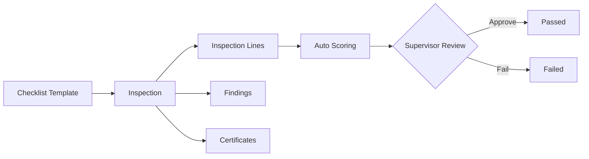
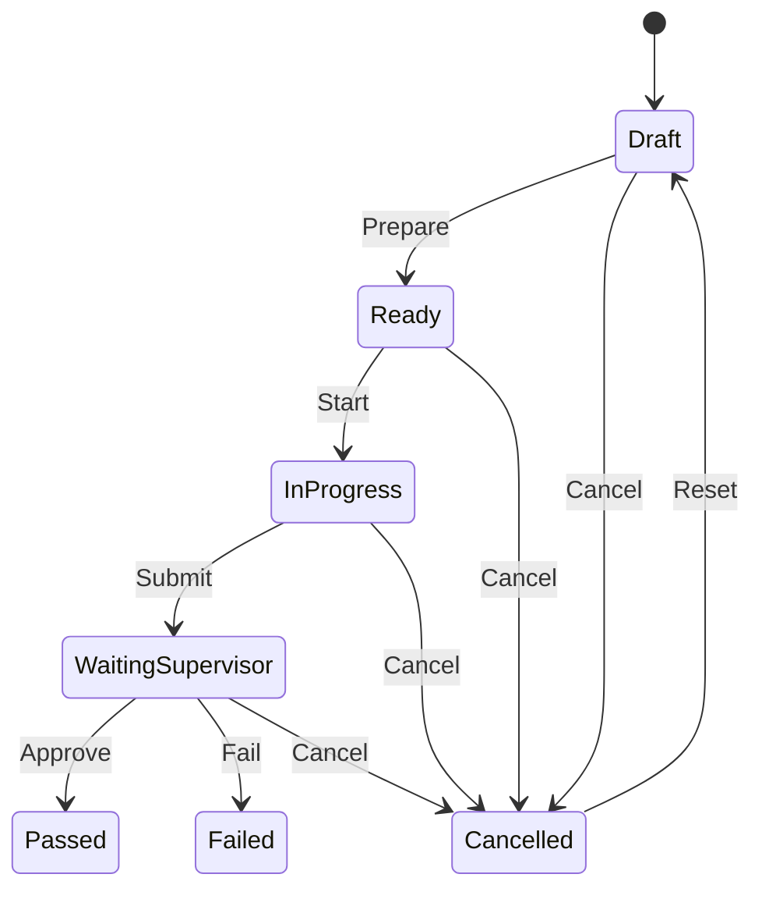

# Odoo 19 Dubai Food Safety Inspection Workspace

[](https://runbot.odoo.com/runbot)
[](https://www.odoo.com/documentation/master)
[](https://www.odoo.com/forum/help-1)
[](https://nightly.odoo.com/)

This repository is a full Odoo 19 source tree with a custom addon at
[addons/dm_food_safety_inspection](addons/dm_food_safety_inspection).

The addon implements a complete Dubai-style food safety workflow:

- inspections with weighted checklist scoring
- supervisor-gated outcomes
- findings and corrective actions
- certificates and expiry tracking
- violation tags and establishment profiles
- dashboard analytics with quick actions
- optional Groq-backed AI summaries

## What Is Included

| Area | Coverage |
| --- | --- |
| Workflow | Draft, Ready, In Progress, Waiting Supervisor, Passed, Failed, Cancelled |
| Scoring | Compliance %, risk score, risk band, grade mapping |
| Inspection Ops | Checklist templates, line evidence, review actions |
| Findings | Severity/status lifecycle, overdue indicators, tag linking |
| Certificates | Draft/Active/Expired/Revoked lifecycle, expiry checks |
| Establishments | Food profile fields on contacts and related record counters |
| Security | Inspector, Supervisor, Manager ACL and company-aware rules |
| UI | Dashboard action, list/form/search views, integration tabs on inspection |
| Demo Data | Expanded multi-record dataset for lively demo sessions |
| Tests | Dashboard, AI summary, and findings/certificates integration coverage |

## Main Functional Flow





## Data Model Highlights

Core workflow:

- [addons/dm_food_safety_inspection/models/dm_food_inspection.py](addons/dm_food_safety_inspection/models/dm_food_inspection.py)
- [addons/dm_food_safety_inspection/models/dm_food_inspection_line.py](addons/dm_food_safety_inspection/models/dm_food_inspection_line.py)
- [addons/dm_food_safety_inspection/models/dm_food_checklist_template.py](addons/dm_food_safety_inspection/models/dm_food_checklist_template.py)
- [addons/dm_food_safety_inspection/models/dm_food_inspection_stage.py](addons/dm_food_safety_inspection/models/dm_food_inspection_stage.py)
- [addons/dm_food_safety_inspection/models/dm_food_inspection_grade.py](addons/dm_food_safety_inspection/models/dm_food_inspection_grade.py)

Expanded operational layer:

- [addons/dm_food_safety_inspection/models/dm_food_finding.py](addons/dm_food_safety_inspection/models/dm_food_finding.py)
- [addons/dm_food_safety_inspection/models/dm_food_certificate.py](addons/dm_food_safety_inspection/models/dm_food_certificate.py)
- [addons/dm_food_safety_inspection/models/dm_food_violation_tag.py](addons/dm_food_safety_inspection/models/dm_food_violation_tag.py)
- [addons/dm_food_safety_inspection/models/res_partner_food_profile.py](addons/dm_food_safety_inspection/models/res_partner_food_profile.py)
- [addons/dm_food_safety_inspection/models/dm_food_inspection_extension.py](addons/dm_food_safety_inspection/models/dm_food_inspection_extension.py)

## AI Summary Provider

The inspection AI summary uses Groq when configured, and falls back to a deterministic local summary when not configured.

Environment variables:

- `GROQ_API_KEY` (required for AI mode)
- `GROQ_MODEL` (optional override, default: `llama-3.3-70b-versatile`)
- `GROQ_USER_AGENT` (optional override for request user agent)

Implementation entry points:

- [addons/dm_food_safety_inspection/models/dm_food_inspection.py](addons/dm_food_safety_inspection/models/dm_food_inspection.py)

## Demo Coverage

The demo file provides rich records across sections to support realistic walkthroughs (multiple establishments, inspections, findings, certificates, tags, and configuration records):

- [addons/dm_food_safety_inspection/demo/dm_food_safety_demo.xml](addons/dm_food_safety_inspection/demo/dm_food_safety_demo.xml)

## Running Locally

Prerequisites:

- Python environment compatible with Odoo 19
- PostgreSQL available and reachable from Odoo
- database created (example: `dm_food_safety_validation`)

Example startup on Windows PowerShell:

```powershell
$env:PGHOST='127.0.0.1'
$env:PGPORT='55432'
$env:PGUSER='odoo'
$env:PGPASSWORD='odoo'
& '.\.venv\Scripts\python.exe' 'odoo-bin' start -d 'dm_food_safety_validation' --http-interface='127.0.0.1' --http-port='8069'
```

Upgrade the custom addon when code changes:

```powershell
& '.\.venv\Scripts\python.exe' 'odoo-bin' -d 'dm_food_safety_validation' -u 'dm_food_safety_inspection' --stop-after-init
```

Open:

```text
http://127.0.0.1:8069/web?db=dm_food_safety_validation
```

## Test Entry Points

- [addons/dm_food_safety_inspection/tests/test_dm_food_inspection.py](addons/dm_food_safety_inspection/tests/test_dm_food_inspection.py)
- [addons/dm_food_safety_inspection/tests/test_dm_food_inspection_post_install.py](addons/dm_food_safety_inspection/tests/test_dm_food_inspection_post_install.py)

Quick module test run example:

```powershell
& '.\.venv\Scripts\python.exe' 'odoo-bin' -d 'dm_food_safety_validation' -u 'dm_food_safety_inspection' --test-enable --stop-after-init
```

## Key UI Files

- [addons/dm_food_safety_inspection/views/dm_food_inspection_views.xml](addons/dm_food_safety_inspection/views/dm_food_inspection_views.xml)
- [addons/dm_food_safety_inspection/views/dm_food_inspection_integration_views.xml](addons/dm_food_safety_inspection/views/dm_food_inspection_integration_views.xml)
- [addons/dm_food_safety_inspection/views/dm_food_finding_views.xml](addons/dm_food_safety_inspection/views/dm_food_finding_views.xml)
- [addons/dm_food_safety_inspection/views/dm_food_certificate_views.xml](addons/dm_food_safety_inspection/views/dm_food_certificate_views.xml)
- [addons/dm_food_safety_inspection/views/dm_food_violation_tag_views.xml](addons/dm_food_safety_inspection/views/dm_food_violation_tag_views.xml)
- [addons/dm_food_safety_inspection/views/res_partner_food_profile_views.xml](addons/dm_food_safety_inspection/views/res_partner_food_profile_views.xml)

## Upstream Odoo References

- [Odoo install documentation](https://www.odoo.com/documentation/master/administration/install/install.html)
- [Odoo developer documentation](https://www.odoo.com/documentation/master/developer/howtos.html)
- [Odoo security disclosure process](https://www.odoo.com/security-report)

