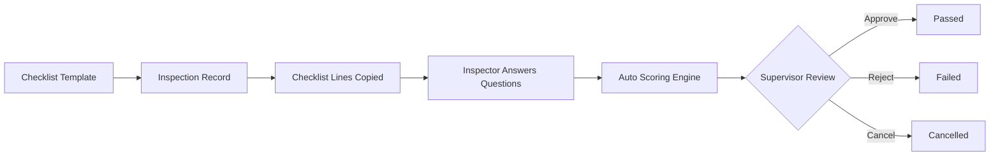
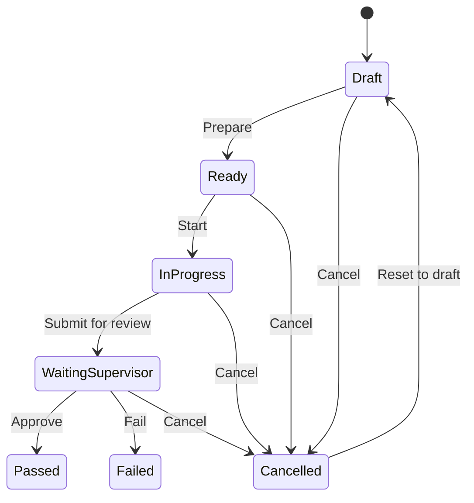
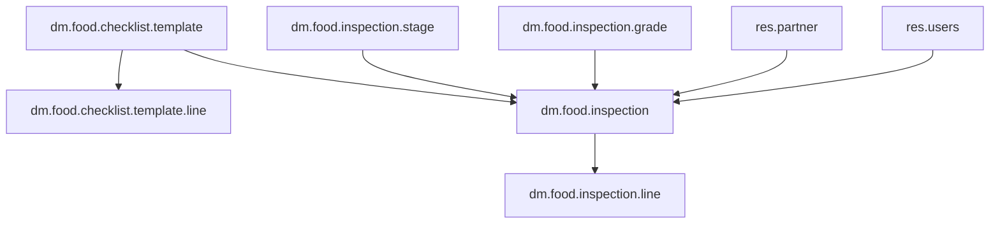

# Odoo 19 Dubai Food Safety Inspection Workspace

[](https://runbot.odoo.com/runbot)
[](https://www.odoo.com/documentation/master)
[](https://www.odoo.com/forum/help-1)
[](https://nightly.odoo.com/)

This repository is a full Odoo 19 source tree with a custom addon for Dubai-style food safety inspections:
[addons/dm_food_safety_inspection](addons/dm_food_safety_inspection).
It adds a reusable checklist system, weighted scoring, risk grading, supervisor review, demo data, and tests.

The goal is simple: an inspector should be able to create an inspection, answer a checklist, have the app compute a score automatically, and move the record through a controlled review flow.

## At A Glance

| Area | What it does |
| --- | --- |
| Inspection workflow | Draft, ready, in progress, waiting supervisor, passed, failed, cancelled |
| Checklist templates | Reusable questions that populate new inspections automatically |
| Scoring | Computes compliance, risk score, risk band, and final grade |
| Security | Inspector, supervisor, and manager access with company-aware record rules |
| UX | Dashboard, list, kanban, form, search, and configuration menus |
| Validation | Demo data and automated tests that cover the workflow |

## How The App Works

1. A checklist template defines the inspection questions.
2. An inspection is created from that template.
3. The template lines are copied into inspection lines.
4. The inspector records pass, fail, or pending answers.
5. The app computes compliance and risk automatically.
6. The supervisor approves or rejects the result.





## Data Model Map



### Core Records

| Model | Purpose |
| --- | --- |
| [dm_food_checklist_template.py](addons/dm_food_safety_inspection/models/dm_food_checklist_template.py) | Stores reusable inspection templates and template lines |
| [dm_food_inspection.py](addons/dm_food_safety_inspection/models/dm_food_inspection.py) | Main inspection workflow, scoring, and stage transitions |
| [dm_food_inspection_line.py](addons/dm_food_safety_inspection/models/dm_food_inspection_line.py) | Answers and scoring for each checklist line |
| [dm_food_inspection_stage.py](addons/dm_food_safety_inspection/models/dm_food_inspection_stage.py) | Workflow stage records and kanban grouping |
| [dm_food_inspection_grade.py](addons/dm_food_safety_inspection/models/dm_food_inspection_grade.py) | Compliance bands such as A, B, C, D, and F |

## Scoring Logic

The app uses a weighted checklist model.

```text
compliance_score = round(achieved_score / total_possible_score * 100)
risk_score = 100 - compliance_score
```

The severity of each checklist line changes its weight in the score:

| Severity | Weight factor |
| --- | --- |
| Low | 1.0 |
| Medium | 2.0 |
| High | 3.0 |
| Critical | 5.0 |

Risk bands are assigned from the calculated risk score:

| Risk score | Band |
| --- | --- |
| 0 - 9 | Low |
| 10 - 29 | Medium |
| 30 - 59 | High |
| 60 - 100 | Critical |

Grades are mapped from compliance percentages:

| Grade | Compliance range |
| --- | --- |
| A - Excellent | 90 - 100 |
| B - Good | 80 - 89.99 |
| C - Acceptable | 70 - 79.99 |
| D - Watchlist | 60 - 69.99 |
| F - Unacceptable | 0 - 59.99 |

## Security Model

| Role | Can do |
| --- | --- |
| Inspector | Create and execute inspections |
| Supervisor | Review, approve, or fail inspections |
| Manager | Manage configuration and full access to records |

The addon also applies company-aware record rules so records stay scoped to the user's company set.

## Screens In The Addon

- Food Safety Dashboard
- Food Safety Inspections
- AI Summary
- Checklist Templates
- Workflow Stages
- Compliance Grades

The main UI is built with Odoo dashboard, list, kanban, form, and search views. The inspection form includes a status bar, checklist lines, an AI summary tab, and chatter, while the configuration screens manage reusable templates and grade thresholds.

## What To Try In The UI

1. Open Food Safety to land on the dashboard.
2. Review the KPI cards and risk breakdown.
3. Open Food Safety -> Food Safety Inspections.
4. Create a new inspection from the restaurant checklist template.
5. Fill in the checklist lines.
6. Click Prepare, Start, and Submit for Review.
7. Generate the AI summary, review it, and apply it to the follow-up note if needed.
8. Approve or fail the inspection as a supervisor.

## Local Run Setup

This workspace was validated on Windows with Python 3.10 in `.venv310` and PostgreSQL 16 on port `5433`.

```powershell
$env:PGHOST='127.0.0.1'
$env:PGPORT='5433'
$env:PGUSER='odoo'
& '.\.venv310\Scripts\python.exe' 'odoo-bin' start -d 'dm_food_safety_validation' --http-interface='127.0.0.1' --http-port='8069'
```

Then open:

```text
http://127.0.0.1:8069/web?db=dm_food_safety_validation
```

Login used during validation:

- Database manager password: `admin`
- Odoo user: `admin` / `admin`

## Validation Notes

- The addon installs cleanly on PostgreSQL 16.
- The module data loads without XML parse errors.
- Demo records are included for a passing and a failing inspection.
- Automated tests cover scoring, stage control, and form-based record creation.

## Key Files

| File | Why it matters |
| --- | --- |
| [addons/dm_food_safety_inspection/__manifest__.py](addons/dm_food_safety_inspection/__manifest__.py) | Module metadata and load order |
| [addons/dm_food_safety_inspection/security/dm_food_safety_security.xml](addons/dm_food_safety_inspection/security/dm_food_safety_security.xml) | Groups and record rules |
| [addons/dm_food_safety_inspection/security/ir.model.access.csv](addons/dm_food_safety_inspection/security/ir.model.access.csv) | ACL matrix |
| [addons/dm_food_safety_inspection/views/dm_food_inspection_views.xml](addons/dm_food_safety_inspection/views/dm_food_inspection_views.xml) | Main inspection UI |
| [addons/dm_food_safety_inspection/views/dm_food_template_views.xml](addons/dm_food_safety_inspection/views/dm_food_template_views.xml) | Template management UI |
| [addons/dm_food_safety_inspection/views/dm_food_stage_grade_views.xml](addons/dm_food_safety_inspection/views/dm_food_stage_grade_views.xml) | Stage and grade configuration UI |
| [addons/dm_food_safety_inspection/demo/dm_food_safety_demo.xml](addons/dm_food_safety_inspection/demo/dm_food_safety_demo.xml) | Demo partners and inspections |
| [addons/dm_food_safety_inspection/tests/test_dm_food_inspection.py](addons/dm_food_safety_inspection/tests/test_dm_food_inspection.py) | Workflow and scoring tests |
| [addons/dm_food_safety_inspection/tests/test_dm_food_inspection_post_install.py](addons/dm_food_safety_inspection/tests/test_dm_food_inspection_post_install.py) | Form-based post-install test |

## Upstream Odoo

This workspace still contains the full Odoo 19 source tree, so the official documentation remains relevant:

- [Odoo install docs](https://www.odoo.com/documentation/master/administration/install/install.html)
- [Odoo developer docs](https://www.odoo.com/documentation/master/developer/howtos.html)
- [Odoo security disclosure](https://www.odoo.com/security-report)

